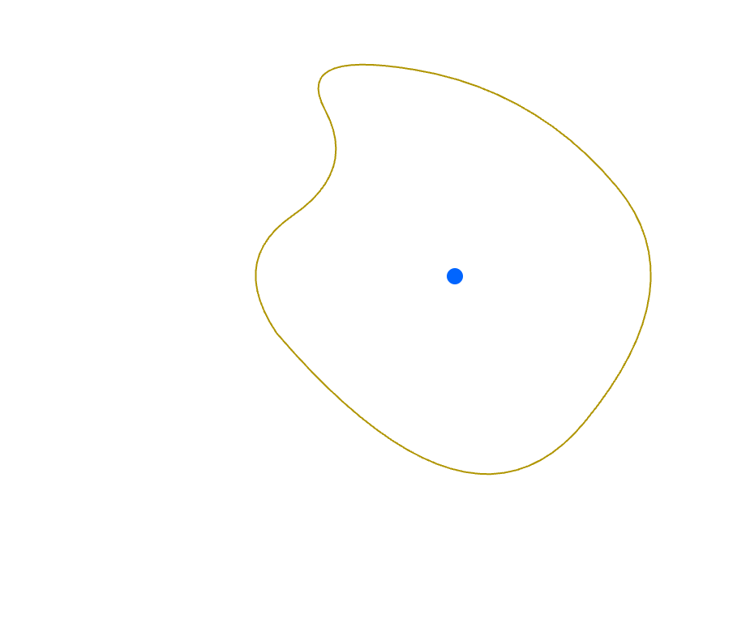

### Taylor Series
By the  Analyticity of Holomorphic Functions Theorem, a holomorphic function $f: \mathbb{C} \to \mathbb{C}$ can be represented by a Taylor series. To construct a Taylor series at a point in the function's domain, the value of the function must be defined at that point. Consequently, a function with a pole (singularity) at a point cannot be represented by a Taylor series at that point. 

### Laurent Series
A meromorphic function (i.e. holomorphic except at singularities in its domain) can be represented at these singularities by a Laurent series, where a Taylor series fails:

$$
    f(z) = \sum_{n=-\infty}^\infty a_n(z-z_0)^n 
$$

The coefficients are given by the following integral:

$$
    a_n = \frac{1}{2 \pi i}\oint_C \frac{f(z)dz}{(z-z_0)^{n+1}} 
$$

The integral is performed over a contour $C$ that encloses the singularity and is inside an annulus with inner and outer radii $r_1$ and $r_2$, respectively, in which $f(z)$ is holomorphic. Shown below is a general contour traced out by $z$, but for convenience the contour $C$ is often taken as a circle centered on $z_0$ with radius $|z-z_0|$ where it must satisfy $r_1 \lt |z-z_0| \lt r_2$, i.e. be within the annulus.

> {: width="50%" }

### Principle & Analytic Parts
The Laurent series can be separated out into two terms, where $b_n = a_{-n}$:

$$
    f(z) = \sum_{n=1}^\infty \frac{b_n}{(z-z_0)^n} + \sum_{n=0}^\infty a_n(z-z_0)^n
$$

We see that a Taylor series is a special case where all negative-power terms are zero. The part with postive-power terms is called the **analytic** part and the part with negative-power terms the **principle** part.
