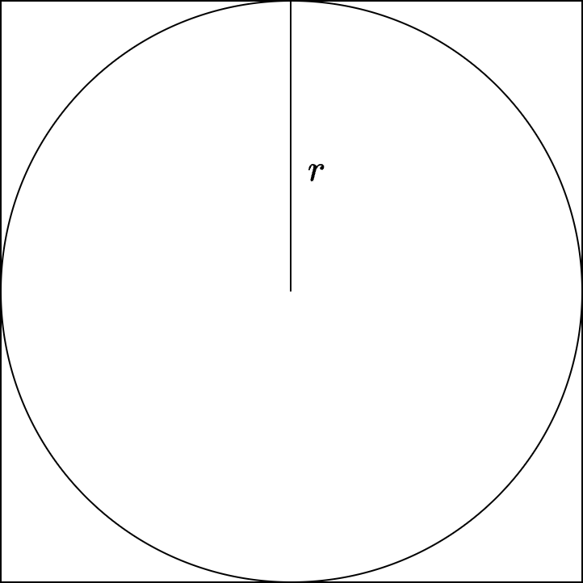

## Basic Idea
The Monte Carlo method is an approach to estimating an unknown value or values by performing an experiment many times, each trial of the experiment receiving input _randomly selected_ from some known domain. One then uses the results of the many trials to estimate the unknown value or values, for example, by taking a mean.

## Example - Estimating $\pi$

Consider a circle of radius $r$ inscribed in a square of side $2r$:

{: width="30%" }

What is the probability that a point randomly selected inside the square will be within the circle? This probability $P_A$ is given by the ratio of the areas of the two shapes:

$$
    P_A = \frac{\pi r^2}{4r^2} = \frac{\pi}{4}
$$

We can also approximate $P_A$ by an empirical probability $P_E$ by simply performing many trials of randomly selecting a point within the square and seeing if it lies within the circle or not:

$$
    P_E = \frac{\text{#results within circle}}{\text{#results outside of circle}}
$$

By the Law of Large Numbers, as the number of trials $n$ increases $P_E$ approaches $P_A$:

$$
    \lim_{n \to \infty} P_E = P_A
$$

We see that by measuring $P_E$ we can in turn estimate the value of $\pi$ given the expression for $P_A$.